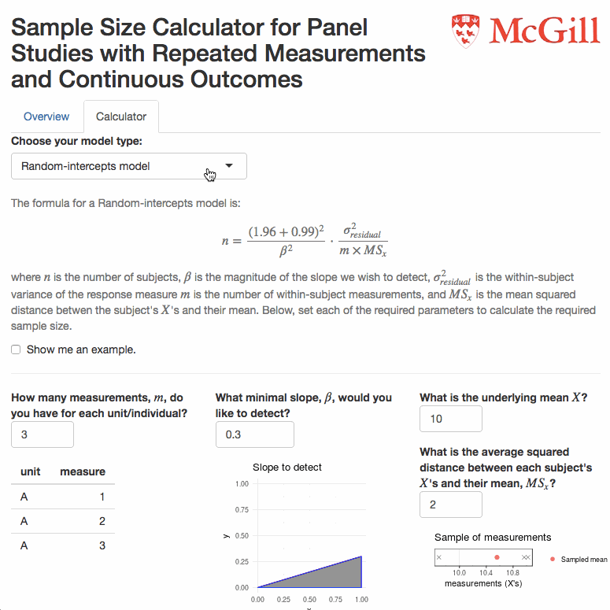
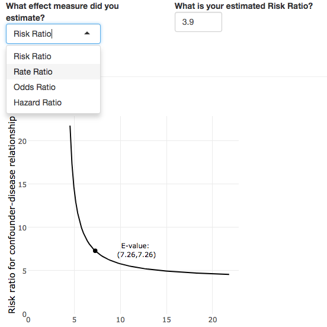

<h2>Web applications and teaching tools</h2>

I have created web applications to aid epidemiologists in performing calculations and teaching epidemiologic concepts.

<h3><a href="https://corinne-riddell.shinyapps.io/mcgilleboh-samplesizecalculator/">Sample size calculator for panel studies</a></h3>

  

   
  

  
  

   <ul>
    <li> Calculate the minimal sample size when you have panel data and a continuous outcome
    </li>
    <li>
      Accompanies the paper 
     <a href="https://www.ncbi.nlm.nih.gov/pubmed/28957035">Sample Size Estimation for Random-effects Models: Balancing Precision and Feasibility in Panel Studies</a>
     in <i>Epidemiology</i> by Scott Weichenthal et al. 
    </li>
    <li>
     <a href="https://github.com/corinne-riddell/SampleSizeCalculator">Github repo</a>
    </li>
   </ul>
  

  

 

<h3><a href="https://corinne-riddell.shinyapps.io/e-value-calculator/">E-value calculator</a></h3>

 
  

   
  

  

   <ul>
    <li>
      Calculate the e-value for relative measures, as introduced by 
      <a href="https://www.ncbi.nlm.nih.gov/pubmed/?term=vanderweele+ding+e-value">Vanderweele and Ding</a>
    </li>
    <li>
     <a href="https://github.com/corinne-riddell/EValue">Github repo</a>
    </li>
   </ul>
  

  

**[The misleading odds ratio](https://drive.google.com/open?id=0B0LpZ0kOzhDTNE9JMXlKV3BGaFhQZEw1VFdsb3ZrZThXZWg0)**
  * This spreadsheet demonstrates how the average risk difference is the only incident measure of association to correctly estimate a measure of average causal effect (under no assumptions).
  * Facilitates the classic epidemiology reading [*Interpretation and choice of effect measures in epidemiologic analyses*](http://www.epidemiology.ch/history/PDF%20bg/Greenland%20S%201987%20interpretation%20and%20choice%20of%20effect%20measures.pdf) by Sander Greenland (1987).
