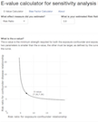

## Web applications and teaching tools

I have created web applications to aid epidemiologists in performing calculations and teach epidemiologic concepts.

div(,
**[E-value calculator](https://corinne-riddell.shinyapps.io/e-value-calculator/)**
  * Calculate the e-value for relative measures, as introduced by [Vanderweele and Ding](https://www.ncbi.nlm.nih.gov/pubmed/?term=vanderweele+ding+e-value).
  * [Github repo](https://github.com/corinne-riddell/EValue))
  
**[Sample size calulator for panel studies](https://corinne-riddell.shinyapps.io/mcgilleboh-samplesizecalculator/)**
  * Calculate the minimal sample size when you have panel data and a continuous outcome
  * Accompanies a forthcoming paper in *Epidemiology* by Scott Weichenthal et al.
  * [Github repo](https://github.com/corinne-riddell/SampleSizeCalculator)

**Greenland spreadsheet**
  * Add info
  
**Second spreadsheet**
  * Add info
